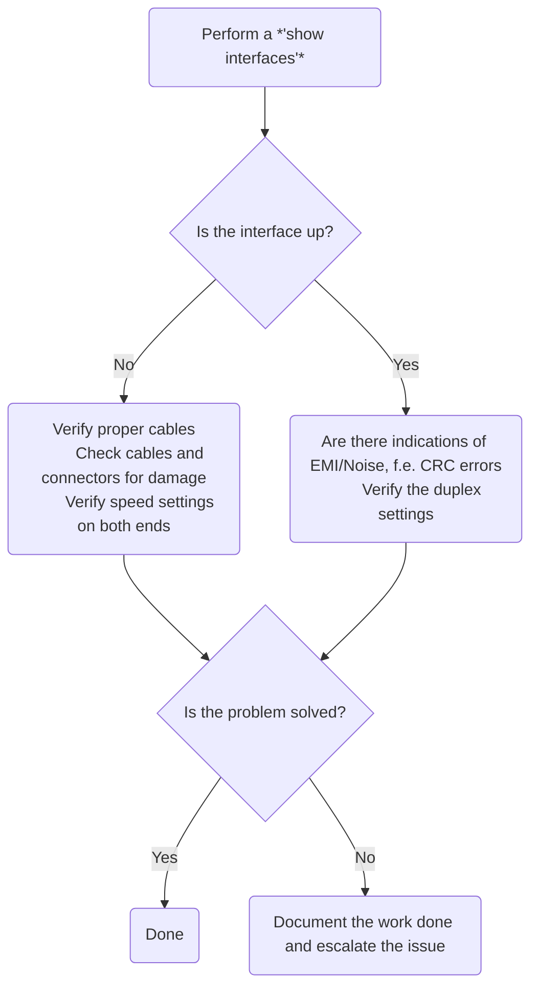

#Networking_Device 
#CCNA 
# Frame Forwarding Methods
Switches use one of two forwarding methods:
- **Store and forward switching**:
  The switch receives the frame, checks the CRC and forwards the frame if it is not corrupted
- **Cut-through switching**:
  The switch forwards the frame before it is entirely received, the destination address of the frame must be read before the frame can be forwarded

Store and forward switching reduces the amount of bandwidth consumed by corrupted data and is necessary for Quality of Service analysis where frame classification for traffic prioritization is necessary, f.e. *Voice over IP (VoIP)* has a priority over web-browsing
## Store and Forward Switching
![[Store and Forward switcing.png]]
The two primary characteristics are:
- **Error checking**: After receiving the frame the switch compares the CRC of the frame with its own
- **Automatic Buffering:** ingress port buffering supports any mix of Ethernet speeds, f.e. a frame coming into a 100 Mbps Port that must be sent out a 1 Gbps port, the switch stores the frame in a buffer 
## Cut-Through Switching
![[Cut Through Switching.png]]
There are two ways of cut-through switching
- **Fast-forward switching**:
  forwards the frame after reading the destination address; has the lowest level of latency and is the typical cut-through switching method
- **Fragment-free switching**:
  the switch stores the first 64 bytes of the frame before forwarding; can be seen as a compromise between store-and-forward switching and cut-through switching

# Memory Buffering
There are two ways of memory buffering:
- **Port-based memory**:
	- frames are stored in a queues linkes to a specific port
	- frames are transmitted only if all frames before it are transmitted
- **Shared memory**:
	- all frames are stored in a memory buffer shared by all ports which is dynamically allocated
	- enables to store larger frames with fewer dropped frames


# Basic Switch Stuff

## Switch Boot Sequence
- **Step 1**:
  First, the Switch loads a *power-on self-test (POST)* program stored in ROM. POST checks the CPU, DRAM and the portion of the flash device that makes up the flash file system.
- **Step 2**:
  Next, the switch loads the boot loader software. The boot loader is a small program stored in ROM that is run immediately after POST successfully completes.
- **Step 3**:
  The boot loader performs low-level CPU initialization. It initializes the CPU registers, which control where physical memory is mapped, the quantity of memory and its speed.
- **Step 4**:
  The boot loader initializes the flash file system on the system board.
- **Step 5**: 
  The boot loader locates and loads a default IOS operating system image into memory and gives control of the switch over to the IOS.

## boot system Command
The switch attempts to automatically boot by using information in the BOOT environment variable. If this variable is not set, the switch attempts to load and execute the first executable file it can find.
The IOS operating system then initializes the interfaces using the [[Cisco IOS CLI]] commands found in the startup-config file, called `config.txt` and is located in flash.

To set the BOOT environment variable we use the `boot system` command in [[Cisco IOS CLI#Global configuration mode| global configuration mode]]. 
```
S1(config)# boot system flash:/c2960-lanbasek9-mz.150-2.SE/c2960-lanbasek9-mz.150-2.SE.bin
```

| Command                           | Definition              |
| --------------------------------- | ----------------------- |
| `boot system`                     | main command            |
| `flash:`                          | storage device          |
| `c2960-lanbasek9-mz.150-2.SE`     | path to the file system |
| `c2960-lanbasek9-mz.150-2.SE.bin` | IOS file name           |
>[!tip]
>Use the command `show boot` to see the current IOS boot file.
>
## Switch LED Indicators
![[Switch LED indicators.png]]
1. **SYST**: System LED
   Shows whether the system is receiving power and is functioning properly.
   -  LED is *off*: it means the system is not powered on.
   - LED ist *blinking green*: the system is operating normally.
   - LED is *amber*: the system is receiving power but is not functioning properly.
1. **RPS**: Redundant Power System LED
   Shows the RPS status. 
   - LED is *off*: the RPS is off or it is not properly connected. 
   - LED is *green*: the RPS is connected and ready to provide backup power. 
   - LED is *blinking green*: the RPS is connected but is unavailable because it is providing power to another device. 
   - LED is *amber*: the RPS is in standby mode or in a fault condition. 
   - LED is *blinking amber*: the internal power supply in the switch has failed and the RPS is providing power.
1. **STAT**: Port Status LED
   -  LED is *green*: port status mode is selected
   - Port LED is *green*: a link is present
   - Port LED is *off*: no link present, port was administratively shut down
   - Port LED is *alternating green-amber*: there is a link fault
   - Port LED is *amber*: port is blocked and will not forward data (ensures there is no loop in the forwarding domain)
   - Port LED is *blinking amber*: port is blocked to prevent a possible loop in the forwarding domain.
1. **DUPLX**: Port Duplex LED
   - LED is *green*: port duplex mode is selected
   - Port LED is *green*: the port is in full-duplex mode 
   - Port LED is *off*: port is in half-duplex mode
1. **SPEED**: Port Speed LED
   Indicates that the port speed mode is selected.
   - Port LED is *off*: port is operating at 10 Mbps
   - Port LED is *green*: port is operating at 100 Mbps
   - Port LED is *blinking green*: port is operating at 1000 Mbps
1. **PoE**: Power over Ethernet Mode LED
   - LED is *off*: PoE mode is not selected
   - LED is *blinking amber*: PoE mode is not selected but at least one port has been denied PoE or has a PoE fault.
   - LED is *green*: PoE mode is selected
   - Port LED is *off*: PoE is off
   - Port LED is *green*: PoE is on
   - Port LED is *alternating green-amber*: PoE is denied, because providing power to the device will exceed the switch power capacity.
   - Port LED is *blinking amber*: PoE is off because of a fault
   - Port LED is *amber*: PoE has been disabled

## Recovering from a System Crash 
The boot loader provides access into the files stored in the flash memory of the switch if the operating system cannot be used because of missing or damaged system files. 
The boot loader command-line interface can be accessed through a console connection following these steps:
- **Step 1**: Connect a PC by console cable to the switch console port. Configure terminal emulation software to connect to the switch.
- **Step 2**: Unplug the switch power chord.
- **Step 3**: Reconnect the power chord to the switch and, within 15 seconds, press and hold the "Mode" button while the System LED is still flashing green
- **Step 4**: Continue pressing the "Mode" button until the System LED turns briefly amber and then solid green
- **Step 5**: The boot loader `switch:` prompt appears in the terminal emulation software on the PC

>[!tip] 
>Type `help` or `?` at the boot loader prompt to view a list of available commands.,

By default, the switch attempts to automatically boot up by using information in the BOOT environment variable. To view the path of the switch BOOT environment variable type the `set` command. Then initialize the flash file system using the `flash_init` command to view the current files in flash.

>[!example] Example Output
>```
>switch: set
BOOT=flash:/c2960-lanbasek9-mz.122-55.SE7/c2960-lanbasek9-mz.122-55.SE7.bin
(output omitted)
switch: flash_init
Initializing Flash...
flashfs[0]: 2 files, 1 directories
flashfs[0]: 0 orphaned files, 0 orphaned directories
flashfs[0]: Total bytes: 32514048
flashfs[0]: Bytes used: 11838464
flashfs[0]: Bytes available: 20675584
flashfs[0]: flashfs fsck took 10 seconds.
...done Initializing Flash.
>```

After flash has finished initializing you can enter the `dir flash:` command to view the directories and files in flash

> [!example] Example Output
> 
> ```
> switch: dir flash:
> Directory of flash:/
>     2  -rwx  11834846  \<date>         c2960-lanbasek9-mz.150-2.SE8.bin
>     3  -rwx  2072      \<date>               multiple-fs
> ```
> 

To change the BOOT environment variable path use the command `BOOT=flash` and verify it by issuing the `set` command again. To load the new IOS, type the `boot` command without any arguments.

> [!example] Example Output
> ```
> switch: **BOOT=flash:c2960-lanbasek9-mz.150-2.SE8.bin**
> switch: set
> BOOT=flash:c2960-lanbasek9-mz.150-2.SE8.bin
> (output omitted)
> switch: boot
> ```

>[!note]
>The boot loader commands support initializing flash, formatting flash, installing a new IOS, changing the BOOT environment variable and recovery of lost or forgotten passwords.
# Port Configuration
## Duplex Communication
- **Full-duplex**:
  increases bandwidth efficiency by allowing both ends of the connection to transmit and receive data simultaneously. This is called bidirectional communication and it requires microsegmentation. There is no collision domain associated with a switch port in full-duplex mode. Have replaced half-duplex switches and is now used by default.
  ![[Full-duplex Communication.png]]
  
  >[!note] Microsegmented LAN
  >A microsegmented LAN is created when a switch port has only one device connected and is operating in full-duplex mode. 
- **Half-duplex**:
  half-duplex communication is unidirectional. It also creates performance issues because data can only flow in one direction, often resulting in collisions. It is typically seen in older hardware, such as hubs and have been replaced by full-duplex switches.
  ![[Half-duplex Communication.png]]

To configure Switch ports use the commands `duplex` and `speed` 
```
S1(config-if) duplex full
S1(config-if) speed 100
``` 

>[!note]
>When the 10/100/1000 ports are set to 10 or 100 Mbps they can operate in both half- and full-duplex. If the ports are set to 1000 Mbps they can only operate in full-duplex.

>[!tip]
>When troubleshooting switch port issues, it is important that the duplex and speed settings should be checked, as mismatched settings for the duplex mode and speed can cause connectivity issues.
>Autonegotiation failure creates mismatched settings.
## Auto MDI-X
To configure [[Cables, Connectors and Ports#Auto MDI-X|auto MDI-X]]  you can use
```
S1(config-if) mdix auto
```

>[!note]
>When using auto MDI-X on an interface, the speed and duplex must be set to `auto` to operate correctly.

## Switch Verification Commands


| Task                                 | Command                                                                |
| ------------------------------------ | ---------------------------------------------------------------------- |
| Display Interface                    | `show interfaces interface-id`                                         |
| Display startup config               | `show startup-congif`                                                  |
| Display running config               | `show running-config`                                                  |
| Display flash file system            | `show flash`                                                           |
| Display hardware and software status | `show version`                                                         |
| Display command history              | `show history`                                                         |
| Display IP information               | `show ip interface interface-id`<br>`show ipv6 interface interface-id` |
| Display MAC address table            | `show mac-address-table`<br>`show mac address-table`                   |
## Network Access Layer Issues
Errors that can be detected using the `show interfaces` command:

| Error           | Description                                                                                                    |
| --------------- | :------------------------------------------------------------------------------------------------------------- |
| Input Error     | Total number of errors                                                                                         |
| Runts           | Frames that are smaller than the minimum frame size (64 byte)                                                  |
| Giants          | Frames that exceed the maximum frame size (1518 byte)                                                          |
| CRC             | The calculated checksum is not the same as the received checksum                                               |
| Output Errors   | Sum of all errors that prevent the final transmission of datagrams out of the interface that is being examined |
| Collisions      | Number of messages retransmitted because of an Ethernet collision                                              |
| Late Collisions | A collision that occures after 512 bit of the frame have been transmitted.                                     |


## Interface Errors
### Input Errors
Input errors is the sum of all errors that were received on the interface.
The errors include: 
- runts
- giants
- CRC 
- no buffer
- frame
- overrun
- ignored counts.

>[!tip]
>On Ethernet and serial interfaces CRC errors usually indicate a media or cable error. If there are too many CRC errors, there is too much noise on the link and you should inspect the cable.
>
### Output Errors
Output errors is the sum of all errors that prevented the final transmission of data out of the interface.
The errors include:
- Collisions
- Late Collisions

>[!tip]
>You should never see Collisions occur on an interface set to full duplex.
>
>Late Collisions can be caused by excessive cable lengths or by duplex misconfiguration. When one of a connection is set to full duplex and the other end is set to half-duplex, late collisions will occur on the half-duplex interface.

# Frame Switching
>[!important] Ingress and Egress
>- **Ingress**: the port where a frame enters the device.
>  - **Egress**: the port that frames will use when leaving the device.
## MAC Address learning
When a switch has to forward a frame it uses a *MAC address table*, which lists the [[(OSI) Open Systems Interconnection-Modell#MAC Addresses| MAC addresses]] and which port the device is connected to to determine the frames destination.
When a Switch receives a frame on one of its ports, it examines the [[Ethernet#Destination and Source|Source field]] and creates an entry for that MAC address and port in its MAC address table.

>[!note]
>MAC addresses learned by a switch in this manner are known as *dynamic MAC addresses*—they are automatically (dynamically) learned. This is in contrast to *static MAC addresses*, which are manually (statically) configured, although that is quite rare. A switch will remove a dynamic MAC address from its MAC address table after 5 minutes of inactivity (if it doesn’t receive a frame from that MAC address for 5 minutes); this is called MAC aging.

## Frame flooding and forwarding
After a Switch has learned the [[(OSI) Open Systems Interconnection-Modell#MAC Addresses|MAC address]] of each host, it can simply look up the destination MAC of a frame in its table and send the frame out of the right port. 
>[!info]
>Frames that are addressed to one destination host are known as *unicast frames*.
>If the switch already has an entry for the destination MAC in its MAC address table it is called a *known unicast address*.
>If the switch does not have an entry it is called a *unknown unicast frame*.

When a Switch receives a unicast frame for a destination MAC address that it does not have an entry for, it *floods* the frame out all ports, except the port the frame was received on. This is done so the frame potentially reaches the destination host and the switch can learn the MAC and port combination when the destination host replies.
Hosts that receive the frame and notice that the destination MAC in the frame is different from their own MAC address will drop the frame.
A switch that receives a flooded frame will also flood the frame out all ports.
![[Fram flooding.png]]
![[Frame flooding reply.png]]
>[!note]
>Switches are *transparent* to the connected hosts, meaning the hosts address their frames directly to each and not to the Switches.

# Collision and Broadcast Domains
## Collision Domains
A *collision domain* is the network segment that shares the same bandwidth between devices. When two or more devices in a collision domain try to communicate at the same time, a collision will occur. 

>[!note]
>There are no collisions when switch ports operate in full-duplex.

## Broadcast Domains
A collection of interconnected switches form a single *broadcast domain*, which can only be divided by a network layer device, such as a router.

>[!note]
Routers divide both broadcast and collision domains.

## Alleviate Network Congestion
Characteristics of switches that alleviate network congestion:
- Interconnected switch ports will attempt by default to establish a link in full-duplex
- **Fast port speeds**
  Switches with faster port speed can reduce congestion:
	- Access layer switches: 100 Mbps, 1 Gbps port speed
	- Distribution layer switches: 100 Mbps, 1Gps and 10 Gbps
	- Core layer and data center switches; 10 Gbps, 40 Gbps and 100 Gbps
- **Fast internal switching**
  Switches use a fast internal bus or shared memory to provide high performance
- **Large frame buffer**
  Switches use large memory buffers to temporarily store more received frames before having to start dropping them. This enables ingress traffic from faster ports (f.e. 1 Gbps) to be forwarded to a slower egress port (f.e. 100 Mbps) without losing frames.
- **High port density**
  High port density reduces costs ( buying 2 48 port switches instead of 4 24 port switches) and helps to keep traffic local, which helps alleviate congestion.

# Switch Configuration
#Cisco_CLI
## Interfaces
```
SW1(config)# interface switch-interface
SW1(config-if)# description descriptionText
SW1(config-if)# speed DataRate 
SW1(config-if)# duplex Duplex
```

### Speed
- maximum rate at which the interface can send and receive traffic in bits per second
- *FastEthernet*: supports 10 and 100 Mbps
- *GigabitEthernet*: supports 10, 100 and 1000 Mbps
- *autonegotiation* automatically determines the matching speed between two devices and is enabled by default

>[!tip]
>If the neighboring device does not use autonegotiation, you should manually configure the speed setting

**Example**
```
SW1(config)# interface g0/1
SW1(config-if)# speed ?
 10 Force 10 Mbps operation 
 100 Force 100 Mbps operation 
 1000 Force 1000 Mbps operation 
 auto Enable AUTO speed configuration 
SW1(config-if)# speed 1000
```

### Duplex
The *duplex* setting refers to whether it is able to send and receive data at the same time or not:
- *Half duplex*: The interface cannot send and receive data at the same time
- *Full duplex*: The interface can send and receive data at the same time

**Example**
```
SW1# configure terminal
SW1(config)# interface g0/1 
SW1(config-if)# duplex full 
SW1(config-if)# interface range f0/1-2 
SW1(config-if)# duplex auto
```

## Secure Remote Access
### Telnet
### SSH
#### Verify the Switch supports SSH
To verify if a switch supports SSH you can use the `show version` command and check if the IOS filename includes a `k9`
```
S1# show version
Cisco IOS Software, C2960 Software (C2960-LANBASEK9-M), Version 15.0(2)SE7, RELEASE SOFTWARE (fc1)
```

You can also use the `show ip ssh` command, if the switch des not support SSH the command will not be recognized. 
#### Configure SSH
1. **Verify SSH support**
```
S1# show ip ssh
```
2. **Configure IP domain**
   With the command `ip domain-name domainName`
```
S1(config)# ip domain-name cisco.com
```
3. **Generate RSA key pairs**
   >[!note]
   >To delete the key pair use `crypto key zeroize rsa`
   >
   
```
S1(config)# crypto key generate rsa
How many bits in the modulus [512]: 1024
```   
4. **Configure user authentication**
   Command: `username userName secret password`
```
S1(config)# username admin secret ccna
```
5. **Configure vty lines**
   Command: `transport input ssh`
```
S1(config)# line vty 0 15
S1(config-line)# transport input ssh
S1(config-line)# login local
S1(config-line)# exit
```
6. **Enable SSH version 2**
```
S1(config)# ip ssh version 2
```
#### Verify SSH is Operational
1. **Connect to the switch with PuTTy**
2. **Login**
```
Login as: admin
Using keyboard-interactive
Authentication.
Password:
S1> enable
Password:
S1#
```
3. **Display SSH version and configuration**
```
S1# show ip ssh
SSH Enabled - version 2.0
Authentication timeout: 120 secs; Authentication retries: 3
To check the SSH connections to the device, use the show ssh command as shown.
S1# show ssh
%No SSHv1 server connections running.
Connection Version Mode Encryption  Hmac                State          Username
0          2.0     IN   aes256-cbc  hmac-sha1    Session started       admin
0          2.0     OUT  aes256-cbc  hmac-sha1    Session started       admin
```

## Configure Default Gateway
To configure the default gateway use the `ip default-gateway ipaddress` command in global configuration mode
```
Switch(config)# ip default-gateway 192.168.1.1
```

## Management Access and SVI Configuration
To prepare  a switch for remote management access, the switch must have *switch virtual interface (SVI)* configured with an IP address and subnet mask or an IPv6 address and prefix. Further to access the switch from a remote network, the switch needs a default gateway. 

By default the switch can be managed through VLAN1, but also all ports are assigned to VLAN1, because of that it is better to use another VLAN for configuration, such as VLAN99.
- **Step 1**: Configure the Management Interface
  - Enter global configuration mode: `S1# configure terminal`
  - Enter SVI interface configuration mode: `S1(config)# interface vlan 99`
  - Configure the IPv4 address: `S1(config-if)# ip address 172.17.99.11 255.255.255.0`
  - Configure the IPv6 address: `S1(config-if)# ipv6 address 2001:db8:acad:99::11/64`
  - Enable the interface: ``S1(config-if)# no shutdown`
  - Return to the privileged EXEC mode: ``S1(config-if) end#`
  - Save the config: `S1# copy running-config sartup-config`
- **Step 2**: Configure the Default Gateway
	- Configure the default gateway: `S1(config)# ip default-gateway 172.17.99.1`
	- Return to privileged EXEC mode: `S1(config)# end`
	- Save the config: `S1# copy running-config sartup-config`
- **Step 3**: Verify Configuration
	- `S1# show ip interface brief`
	- `S1# show ipv6 interface brief`